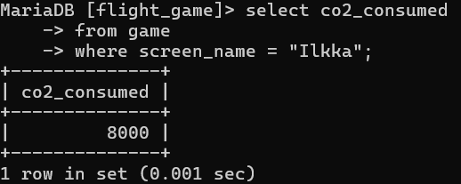

Yhteen tauluun kohdistuvien kyselyiden harjoitukset

1. select * from goal

    

2. select name as airport_type from airport where iso_country = "FI";

    

3. select airport.name, airport.type
    -> from airport
    -> where iso_country = "FI"
    -> order by airport.name asc;

    

4. select airport.name, airport.type
    -> from airport
    -> where iso_country = "FI"
    -> order by airport.type asc, airport.name asc;

    

5. select name
    -> from country
    -> where name like 'f%';

    

6. select name
    -> from country
    -> where name like '%F%';

    

7. select location
    -> from game
    -> where screen_name = "Vesa";

    

8. select co2_consumed
    -> from game
    -> where screen_name = "Ilkka";

    
