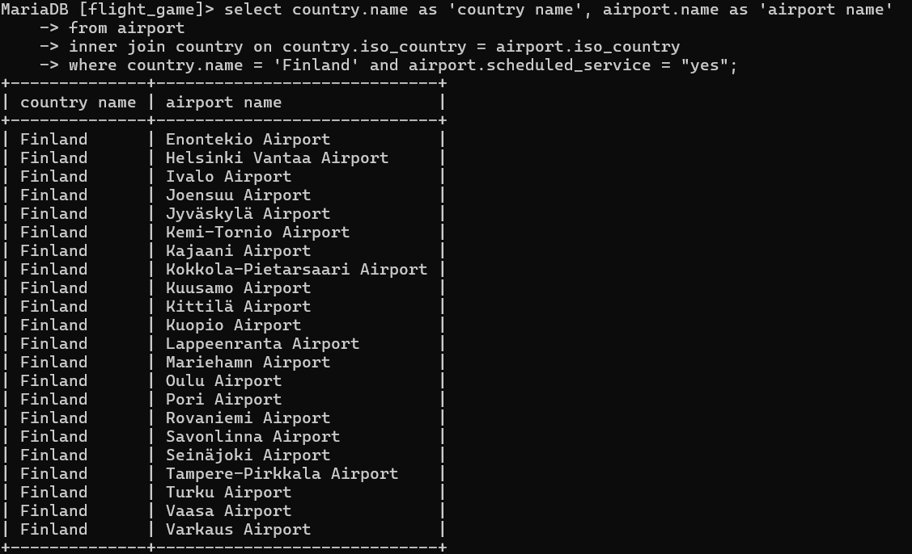
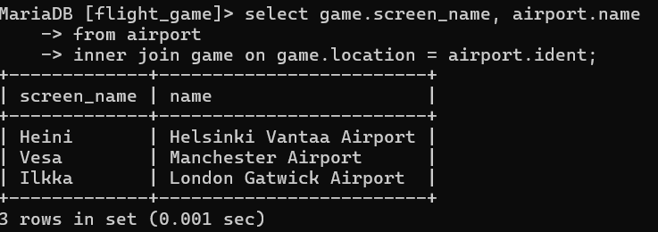
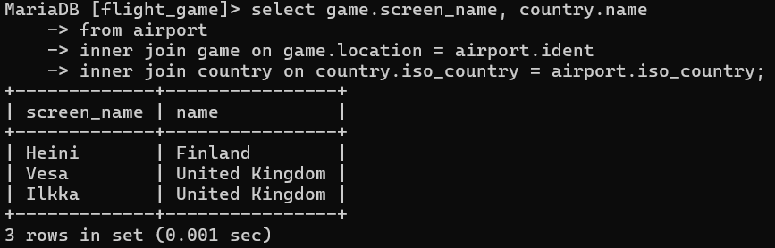
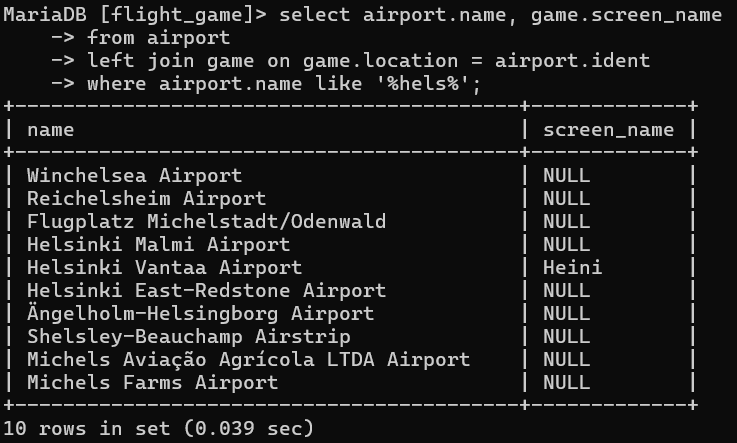
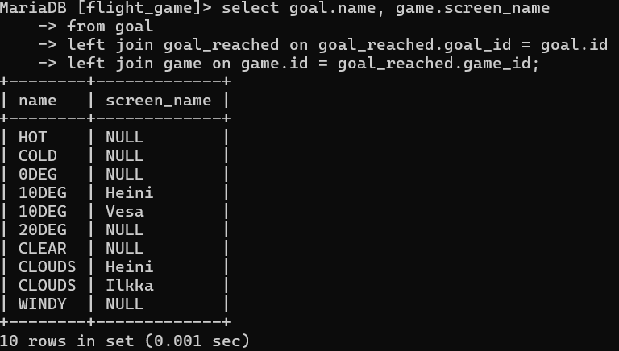

Join-harjoitukset

1. select country.name as 'country name', airport.name as 'airport name'
    -> from airport
    -> inner join country on country.iso_country = airport.iso_country
    -> where country.name = 'Finland' and airport.scheduled_service = "yes";

    

2. select game.screen_name, airport.name
    -> from airport
    -> inner join game on game.location = airport.ident;

    

3. select game.screen_name, country.name
    -> from airport
    -> inner join game on game.location = airport.ident
    -> inner join country on country.iso_country = airport.iso_country;

    

4. select airport.name, game.screen_name
    -> from airport
    -> left join game on game.location = airport.ident
    -> where airport.name like '%hels%';

    

5. select goal.name, game.screen_name
    -> from goal
    -> left join goal_reached on goal_reached.goal_id = goal.id
    -> left join game on game.id = goal_reached.game_id;

    

