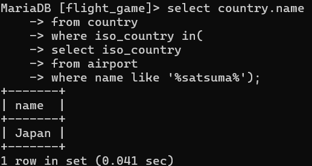
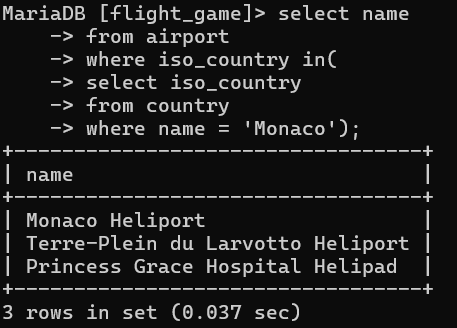
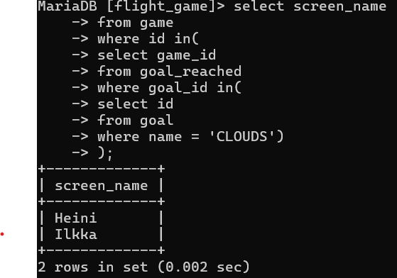
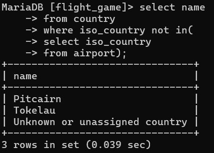
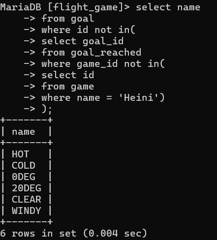

Join-harjoitukset

1. select country.name as 'country name', airport.name as 'airport name'
    -> from airport
    -> inner join country on country.iso_country = airport.iso_country
    -> where country.name = 'Finland' and airport.scheduled_service = "yes";

    

2. select game.screen_name, airport.name
    -> from airport
    -> inner join game on game.location = airport.ident;

    

3. select game.screen_name, country.name
    -> from airport
    -> inner join game on game.location = airport.ident
    -> inner join country on country.iso_country = airport.iso_country;

    

4. select airport.name, game.screen_name
    -> from airport
    -> left join game on game.location = airport.ident
    -> where airport.name like '%hels%';

    

5. select goal.name, game.screen_name
    -> from goal
    -> left join goal_reached on goal_reached.goal_id = goal.id
    -> left join game on game.id = goal_reached.game_id;

    

Sisäkysely

1. select country.name
    -> from country
    -> where iso_country in(
    -> select iso_country
    -> from airport
    -> where name like '%satsuma%');

    

2. select name
    -> from airport
    -> where iso_country in(
    -> select iso_country
    -> from country
    -> where name = 'Monaco');
    
    

3. select screen_name
    -> from game
    -> where id in(
    -> select game_id
    -> from goal_reached
    -> where goal_id in(
    -> select id
    -> from goal
    -> where name = 'CLOUDS')
    -> );

    

4. select name
    -> from country
    -> where iso_country not in(
    -> select iso_country
    -> from airport);
    
    

5. select name
    -> from goal
    -> where id not in(
    -> select goal_id
    -> from goal_reached
    -> where game_id not in(
    -> select id
    -> from game
    -> where name = 'Heini')
    -> );

    