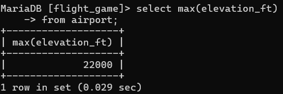
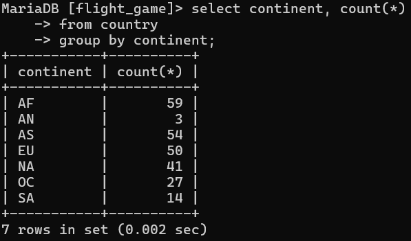
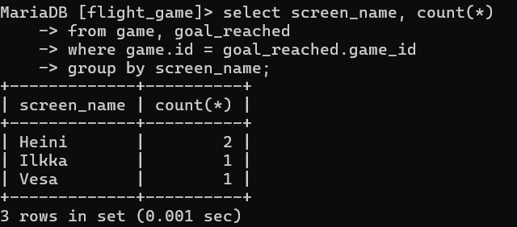
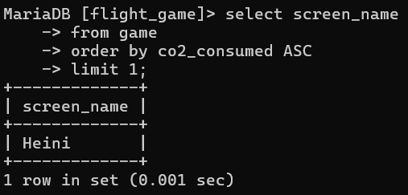
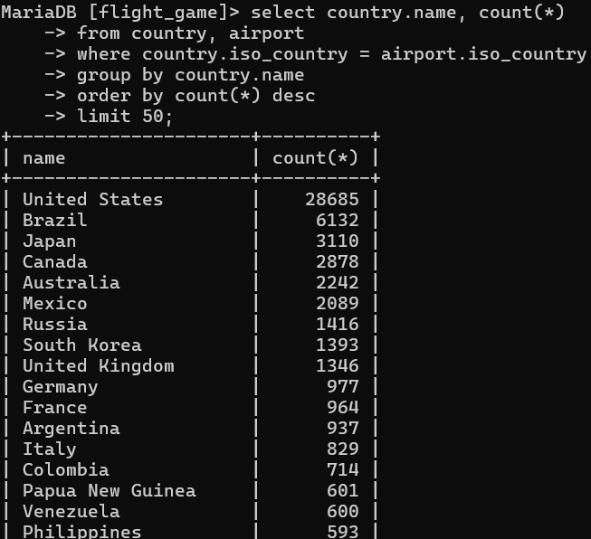
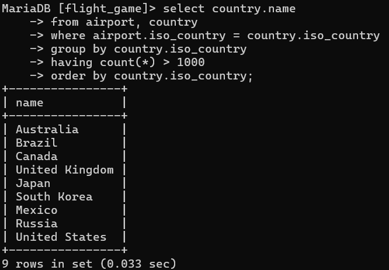
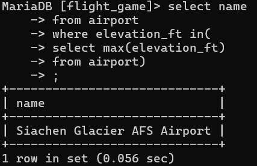
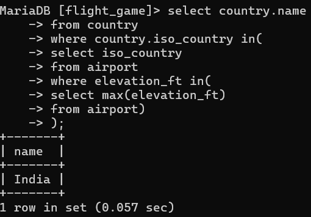
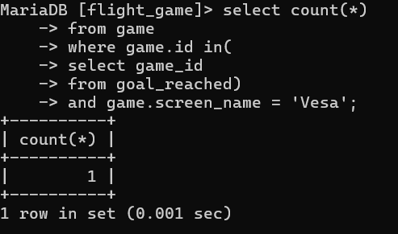
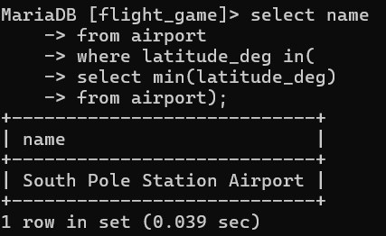

Koostetieto kyselyt

1. select max(elevation_ft)
    -> from airport;

    

2. select continent, count(*)
    -> from country
    -> group by continent;

    

3. select screen_name, count(*)
    -> from game, goal_reached
    -> where game.id = goal_reached.game_id
    -> group by screen_name;

    

4. select screen_name
    -> from game
    -> order by co2_consumed ASC
    -> limit 1;

    

5. select country.name, count(*)
    -> from country, airport
    -> where country.iso_country = airport.iso_country
    -> group by country.name
    -> order by count(*) desc
    -> limit 50;

    

6. select country.name
    -> from airport, country
    -> where airport.iso_country = country.iso_country
    -> group by country.iso_country
    -> having count(*) > 1000
    -> order by country.iso_country;

    

7. select name
    -> from airport
    -> where elevation_ft in(
    -> select max(elevation_ft)
    -> from airport)
    -> ;

    

8. select country.name
    -> from country
    -> where country.iso_country in(
    -> select iso_country
    -> from airport
    -> where elevation_ft in(
    -> select max(elevation_ft)
    -> from airport)
    -> );

    

9. select count(*)
    -> from game
    -> where game.id in(
    -> select game_id
    -> from goal_reached)
    -> and game.screen_name = 'Vesa';

    

10. select name
    -> from airport
    -> where latitude_deg in(
    -> select min(latitude_deg)
    -> from airport);

    